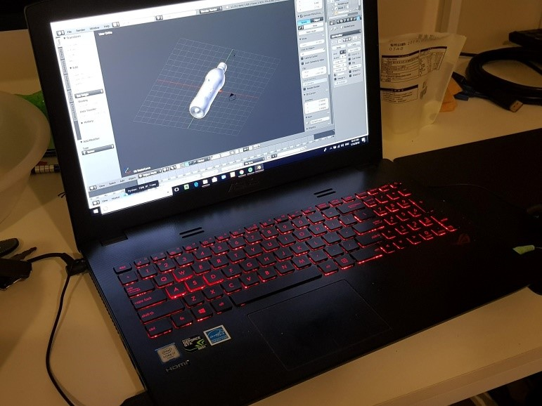

# Bowling-Champion
## Game Design
### Features
•	Physics: Physics that affect the interacting objects of the game i.e. The ball, the lane and the pins.
•	Precision Mechanics: Game controls that are precise, requiring skill for execution.
•	Game flow: The game works in turns and a whole game consists of 20 turns.
•	Score: The score is calculated for every turn and show in the GUI, the total score is calculated and shown at the end.
•	Levels: Each level features a unique style which can be seen in the whole visual.
### Story
The game follows a champion of the world of bowling in a journey to overcome his limits. His journey takes him to unique places which will test him and his abilities. He starts on the streets of New York where he expands his skills to a situation different from a normal bowling alley. He is then challenged by his gamer friend, so he plays on his room. He then decides to go to the extreme, so he goes to Antarctica to play. Finally, his passion takes him to the final frontier and our champion travels to space to become the ultimate bowling champion. 
### Goal
Each level features an unique ball, lane and pins, the player must throw the ball through the lane and hit the as most pins as possible at the end of the lane. A turn consists of two throws, when the turn ends the pins are reset, if you are able to take out all the pins in the same turn then you get a strike which gives you double points, the ultimate goal is to get as much strikes as possible.
### Control
The game controls consist of two parts, the first one is simple you are able to position the ball anywhere along the x axis as a starting point allowing you to throw at an angle. On the second part you have to use your mouse, you drag it from the center of the screen to an upward direction, any slight deviation on the mouse direction will cause the ball to steer on that direction requiring you to be very precise. 
### Levels
•	Underground Level: You are in the streets of New York in front of some apartment building you got a soccer ball and some coke bottles and you made an improvised bowling alley which you use to practice.

 
 
•	Pier Level: Your friend invited you to the beach where you coincidentally find that there are using the pier as bowling lane, you being the avid player you are of course, there won’t be a chance that you’ll not participate on this event.

 
 
•	Antarctic Level: You decide to take your game to the next level so you travel to the Antarctic to play at extreme conditions. You play in the ice with some cute penguins, you can see the mountains covered in snow

•	Space Level: People have noticed your passion for the game and so you have been invited to travel to space to be the best bowling champion both in Earth and outside Earth!

### Particle Systems
•	Level 1-  Some Soda Bottles which are on both sides of the lane emit an upward almost spark like particle systems.
•	Level 2- The boat on left of the alley has a particle system attached in which it emits  a smoke like effect making it seems as if the boat is burning. There are also three particle systems at the beginning of the bowling alley to make it seem as it is raining on the current scene.
•	Level 3- On the lane floor area there are three particle systems of the same type which give the effect of thunderstorm clouds making it harder for the player to aim at the pins.
•	Level 4-Now that our player has reach the outer place , his advancement on his bowling skills make his throws leave a trail of fire. This is made with a particle system which is embedded on the ball and emits the fire particles as it rolls.

### Sounds Effects
•	Each Scene has their own background music: 
o	Level 1 – Arcade Funk
o	Level 2 – Power Up
o	Level 3 – Pim Poy
o	Level 4 – Space Trip
o	Main menu – Star Master loop
o	Player Wins – Ending music
•	Balls has a rolling sound effect
•	Player win screen has some explosive sound effects as well.

### System Architecture

## Technical Section
### Finite State Machines
#### Pin Sweeper animation state machine.
On a bowling lane there is a mechanism which swipes fallen pins out of the way every turn or if it’s the end of the turn it proceeds to sweep all pins and place new ones. We implemented this as well and we did not have the need to write any code for it. We achieved this with the use of the animator on unity. 
It works in the following manner:
We first have a rectangle which we call the sweeper, it is a physically collide able object yet we set it as a kinematic object because we will be giving it a motion of our own.
Then we create an animator which is the actual controller of the frames that we save on the sweeper’s swipe animation.  

The picture above is the animators states which as previously stated just run the frames of the animation.
#### Pin Setter Raise,Sweep,Lower state machine.
Related to the Sweeper there is also a state machine for placing of non-fallen pins or replacing of them at the end of the turn. The machine works as follows:

“At the end of every thrown ball the remaining pins that did not fall will be for  raised to avoid collision with the sweeper. After the sweeping we proceed to lower the remaining pins. The player makes it’s second throw and all pins are sweeped away. The Pin Setter instantiates a new set of Pins and lowers them on to the lane.”
Thus we are now able to renew and destroy pins every turn if needed.
Pin Setter code

### Physics
#### Calculating the balls velocity.
To throw the ball we simulate a swipe with our mouse as input device. The player holds the left click and drags on to direction he wishes to aim.
 We capture four important values here:
1.	Initial click time
2.	Initial click position
3.	Click release time
4.	Click release position
Afterwards we use the following formula to calculate the velocity in both x and z directions.
Float launchSpeedX  = dragEnd.x – dragStart.x/ dragDuration
Similarly for Z (we use the y component as our canvas works on a two coordinate plane)
Float launchSpeedY = dragEnd.y – dragStart.y /dragDuration
With these two values we proceed to assign these values on a new Vector3 to our balls velocity component in the following manner:
Ball.velocity = new Vector3 (launchSpeedX, 0 , laucnSpeedY)
The Y value of our vector is 0 as we don’t want the ball to go upwards in the air.
This is our code for calculating the velocity:

#### Checking whether a Pin is down.
To check whether a pin is down we check each of the pins rotations but we first have to translate them into Euler values because otherwise the values can be hard to work with when error checking.
More specifically we check the tilt in the x and values to then compare them to a standingThreshold value we chose. This is our code:

#### Creating of our own meshes
1.	Coke Bottles
2.	Penguins
3.	Mountain Dew Bottles
We used blender to create these meshes, all of them were made with the same technique in which we add a curve with multiple points and then we generate a mesh as a screw using the y-axis, this is a simple way of doing objects that have cylindrical symmetry. We then mapped the UV in order to apply textures to this meshes.

## Contributions and Implementations

### Alden:
•	Antarctic and Space Level: worked on the final two levels he used the textures necessary for the environment and made changes to the boundaries of the lane to add difficulty.
•	Collision Detection and Handling: implemented the collision physics using the Unity framework, giving a body to the ball and the pins and setting a static motion to the lane.	
•	Camera: set up the camera, first is static at the start of the lane but after throwing the ball it is set to change position along with the ball to follow it, once the ball reaches the end of the lane the camera is reset to the original position.
•	Secondary camera: There is a secondary camera which is rendered on a panel of our UI which shows an over the top view of the pins.
•	Search for additional assets.
### Jorge:
•	Street-Underground and Pier Level: worked on the first two levels, he set walls on the boundaries to decrease the difficulty and implemented the textures and models related to the theme.
•	GUI: set up the GUI which shows the score for each turn of the game and how many standing pins remain on the current throw, also it allows the player to go to the next level with a button or to set the god mode. It also shows a top view of the pins using viewport manipulation.
•	Self-made Materials: with the use of blender we made three different items which we place through out our levels. The Coke bottles on the first level, Penguins on the third Level and finally the Mountain Dew bottles on the second level. 
•	Search for additional assets.
## Schedule/Milestones

## Strength Weaknesses Opportunities and Threats Analysis

## Conclusion
We believe that the game we developed is good enough taking in account the amount of time and effort we put into it. It was a lot of time approximately about 40 hours between the two of us and this includes the time we spent watching tutorials, reading documentation, fixing mistakes, etc. But we can say for sure that every second spent was a second we were enjoying. We were not expecting Unity to be so friendly and powerful, we can not understand how people, professional developers , look down on this platform. It may not have the best graphics, physics or anything but what it is and what it can achieve is more than enough for the growing market of  indie developers.
As we state, we really enjoyed working on this project and we plan to continue learning and developing games on this platform.

